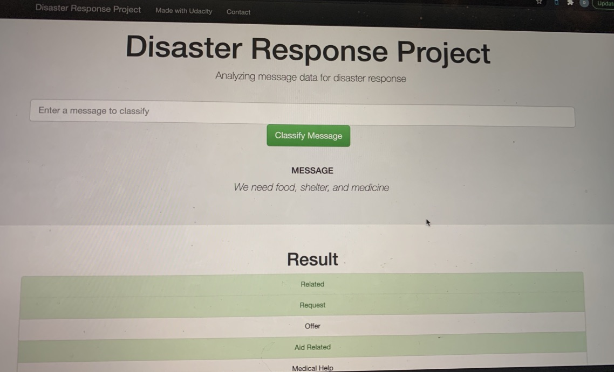
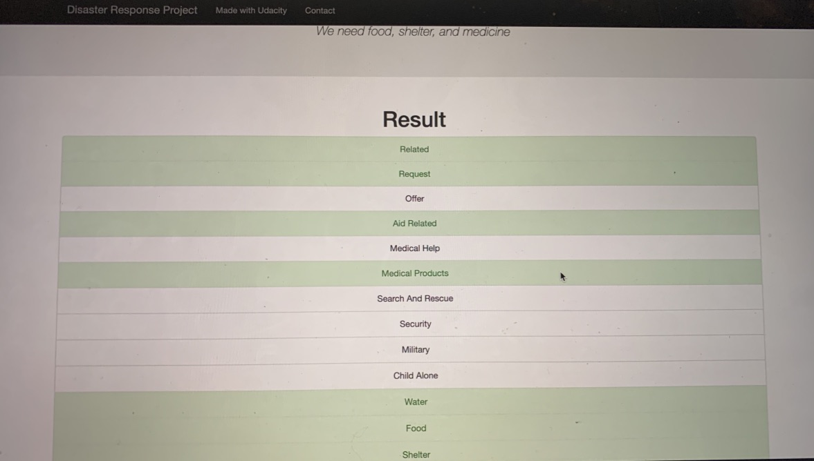
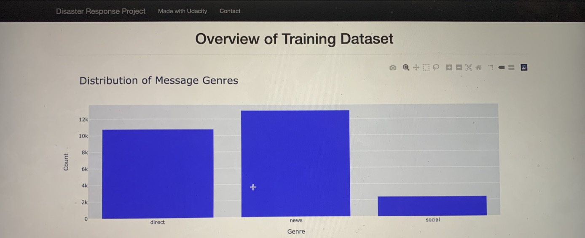
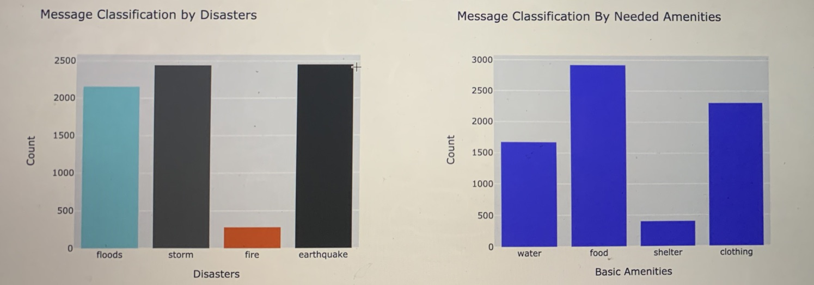

# Disaster Response Pipeline Project
### Project Motivation
The project classifies messages received during a disaster in other for different aid agencies to provide 
appropriate resources to people in need.

### Built With:
* Python 3
* html
* Pandas
* Numpy
* Scikit-learn

### File Description
* app   | - template   |  | - master.html #main page of the web app  | | - go.html #classification result page of web app   | | - run.py # Flask file that runs the app
* data   | - disaster_categories.csv # data to process   | - disaster_messages.csv # data to process   | - process_data.py   | - DisasterResponse.db #database to save clean data
* models   | - train_classifier.py   | - classifier.pkl #saved model
* README.md

### Getting Started
* #### Installation
    install Anaconda or Python version 3, scikit-learn, pandas, and numpy

* #### Instructions:
1. Run the following commands in the project's root directory to set up your database and model.

    - To run ETL pipeline that cleans data and stores in database
        `python data/process_data.py data/disaster_messages.csv data/disaster_categories.csv data/DisasterResponse.db`
    - To run ML pipeline that trains classifier and saves
        `python models/train_classifier.py data/DisasterResponse.db models/classifier.pkl`

2. Run the following command in the app's directory to run your web app.
    `python run.py`

3. Go to http://0.0.0.0:3001/

### Usage
Enter message into the input textbox, then click 'classify message' to get the categories the message is classified under.

Visualizations of the collected messages

### License
MIT License

Copyright (c) [2020] [Olabisi Balogun]

Permission is hereby granted, free of charge, to any person obtaining a copy of this work and its associated documentation files including without
limitation to the rights to use, copy, and modify the work.

### Acknowledgement
Parts of code were referenced from Udacity

